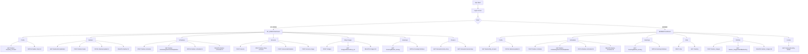

# One App, Two Roles (SP_ADMIN + BARBER)

```mermaid
flowchart TD
  A[App Open] --> B[Login Screen]
  B --> C{Role?}

  C -->|SP_ADMIN| S0[SP_ADMIN Dashboard]
  C -->|BARBER| R0[BARBER Dashboard]

  %% SP_ADMIN FLOW
  S0 --> S1[Profile]
  S1 --> S1a[GET /barber-shop/My_Accaunt]
  S1 --> S1b[PATCH /barber-shop/:id]

  S0 --> S2[Barbers]
  S2 --> S2a[GET /barber/all-myBarbers]
  S2 --> S2b[POST /barber/create]
  S2 --> S2c[PATCH /barber/update/:id]
  S2 --> S2d[DELETE /barber/:id]

  S0 --> S3[Schedules]
  S3 --> S3a[POST /barber-schedule]
  S3 --> S3b[GET /barber-schedule/getSchedulesByBarber]
  S3 --> S3c[PATCH /barber-schedule/:id]
  S3 --> S3d[DELETE /barber-schedule/:id]

  S0 --> S4[Services]
  S4 --> S4a[POST /service]
  S4 --> S4b[POST /barber-shop-services]
  S4 --> S4c[POST /service/add-barbers]
  S4 --> S4d[POST /service-image]

  S0 --> S5[Shop Images]
  S5 --> S5a[POST /images]
  S5 --> S5b[GET /images/BarberShop_all]
  S5 --> S5c[DELETE /images/:id]

  S0 --> S6[Bookings]
  S6 --> S6a[GET /booking/Barber_bookig]
  S6 --> S6b[PATCH /booking/:id/status]

  S0 --> S7[Finance]
  S7 --> S7a[GET /transactions/my-shop]
  S7 --> S7b[GET /transactions/summary]

  %% BARBER FLOW
  R0 --> R1[Profile]
  R1 --> R1a[GET /barber/My_Accaunt]
  R1 --> R1b[PATCH /barber/update/:id]

  R0 --> R2[Schedules]
  R2 --> R2a[POST /barber-schedule]
  R2 --> R2b[GET /barber-schedule/getSchedulesByBarber]
  R2 --> R2c[PATCH /barber-schedule/:id]
  R2 --> R2d[DELETE /barber-schedule/:id]

  R0 --> R3[Bookings]
  R3 --> R3a[GET /booking/Barber_bookig]
  R3 --> R3b[PATCH /booking/:id/status]

  R0 --> R4[Chat]
  R4 --> R4a[POST /chat]
  R4 --> R4b[GET /chat/my]

  R0 --> R5[Portfolio]
  R5 --> R5a[POST /barber_images]
  R5 --> R5b[GET /barber_images/findAllBarberImg]
  R5 --> R5c[DELETE /barber_images/:id]

  R0 --> R6[Income]
  R6 --> R6a[GET /transactions/my-barber]
```
